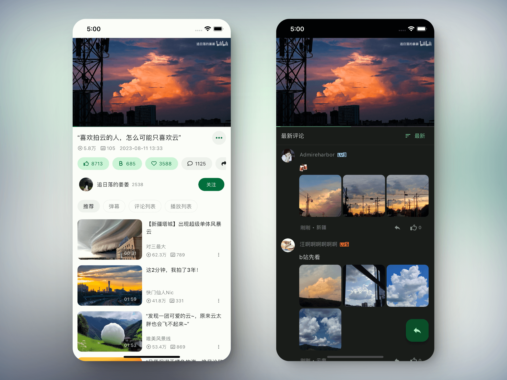
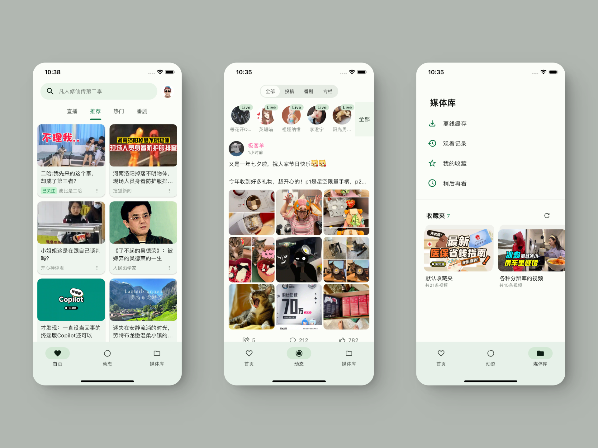

    

    <h1>PiliPlus-A</h1>

    
 
 
 

    
使用Flutter开发的全平台BiliBili第三方客户端 (PiliPlus-A)

    
<a href="BUILD.md">📖 查看多平台编译与发布指南 (BUILD.md)</a>

    

 

 

 

## 适配平台

- [x] Android
- [x] iOS
- [x] Pad
- [x] Windows
- [x] Linux

## refactor

- [ ] gRPC [wip]
- [x] 用户界面
- [x] 其他

## 特性亮点 (Highlights)

- [x] **免登录 / 普通账号高画质直接解析**：通过 gRPC `PlayViewUnite` / `PlayView` 协议与智能降级通道，直接获取 1080P/4K 最高分辨率与无损音视频流。
- [x] **本地离线视频下载与标准 MP4 导出**：完整的下载管理系统，下载完成后直接生成标准 MP4 容器文件，方便随时本地播放与跨平台分享。
- [x] **AI 原声翻译与多语种配音**：支持哔哩哔哩官方多语言 AI 原声翻译音轨选择与切换，在播放设置和扩展设置中提供全局开关。
- [x] **播放器底栏控制项完全自定义**：支持在“外观设置 -> 播放器底栏控件编辑”中拖拽排序和自由开关底部控制按钮。
- [x] **AMD FidelityFX CAS 片段着色器 (Fragment Shader)**：内置 Contrast Adaptive Sharpening 着色器，GPU 单周期自适应动态画面锐化。
- [x] **Dart FFI 直连 OpenCL 独立显卡 GPU 加速**：直连独立显卡（如 NVIDIA GeForce）进行异步媒体运算，解放 UI 主线程。
- [x] **Windows 内存雪崩防御与 D3D11 零拷贝硬解**：MPV 解复用硬限 64MB，默认 Direct3D 11 硬件加速，根治 Pagefile 禁用环境下系统物理内存枯竭引发的应用断网与崩溃。
- [x] **视频输出渲染后端配置 (`VoType`)**：支持自由选择 `auto`、`gpu`、`gpu-next`、`direct3d`、`mediacodec-embed`。
- [x] **HDR 色彩映射支持**：动态注入 MPV `target-colorspace-hint`，完美还原 HDR10 / 杜比视界高动态对比范围。
- [x] **港澳台专属代理服务器与频道直达**：提供代理配置、实时 Ping 测速与重试拦截器，直接浏览出海限定番剧与时间线。
- [x] **专栏/图文动态全图库连续浏览**：跨段落图片聚合为统一连续相册画廊，点击即可无缝左右滑行畅览。
- [x] **桌面端全方位强化**：桌面悬浮垂直音量条、主页退出自动最小化至系统托盘常驻、画中画退出时精确复原窗口尺寸/位置、全套全局快捷键（`Ctrl+,` / `Alt+H` / `F` 等）及说明面板。
- [x] **平板/车机横屏设备自适应全屏**：横屏状态自动进入无黑边全屏沉浸播放，转回竖屏平滑退出。
- [x] **精细化播放控制**：双击快进与快退时长独立分别设置、倍速按钮长按快速在 1.0X 与 2.0X 间无缝切换、视频原画封面一键下载保存。

## feat

- [x] 编辑动态
- [x] DLNA 投屏
- [x] 离线缓存/播放
- [x] 移动端支持点击弹幕悬停，点赞、复制、举报 by [@My-Responsitories](https://github.com/My-Responsitories)
- [x] 播放音频
- [x] 跳过番剧片头/片尾
- [x] 安卓端 `loudnorm` 适配 by [@My-Responsitories](https://github.com/My-Responsitories)
- [x] Win/Mac 支持极验、短信登录 by [@My-Responsitories](https://github.com/My-Responsitories)
- [x] 视频截取动图 by [@My-Responsitories](https://github.com/My-Responsitories)
- [x] AI 原声翻译
- [x] SuperChat
- [x] 播放课堂视频
- [x] 发起投票
- [x] 发布动态/评论支持`富文本编辑`/`表情显示`/`@用户`
- [x] 修改消息设置
- [x] 修改聊天设置
- [x] 展示折叠消息
- [x] 查看用户图文
- [x] 动态话题
- [x] 直播分区
- [x] 分享`视频`/`番剧`/`动态`/`专栏`/`直播`至消息
- [x] 创建/修改/删除关注分组
- [x] 移除粉丝
- [x] 直播弹幕发送表情
- [x] 收藏夹排序
- [x] 稍后再看 ~~`未看`~~ / `未看完` / ~~`已看完`~~ 分类
- [x] WebDAV 备份/恢复设置
- [x] 保存评论/动态
- [x] 高级弹幕 by [@My-Responsitories](https://github.com/My-Responsitories)
- [x] 取消/置顶评论
- [x] 记笔记
- [x] 多账号支持 by [@My-Responsitories](https://github.com/My-Responsitories)
- [x] 屏蔽带货动态/评论
- [x] 互动视频
- [x] 发评/动态反诈
- [x] 高能进度条
- [x] 滑动跳转预览视频缩略图
- [x] Live Photo
- [x] 复制/移动/排序收藏夹/稍后再看视频
- [x] 超分辨率
- [x] 合并弹幕
- [x] 会员彩色弹幕
- [x] 播放全部/继续播放/倒序播放
- [x] Cookie登录
- [x] 显示视频分段信息
- [x] 调节字幕大小
- [x] 调节全屏弹幕大小
- [x] 收藏夹/稍后再看多选删除
- [x] 搜索用户动态
- [x] 直播弹幕
- [x] 修改头像/用户名/签名/性别/生日
- [x] 创建/编辑/删除收藏夹
- [x] 评论楼中楼查看对话
- [x] 评论楼中楼定位点击查看的评论
- [x] 评论楼中楼按热度/时间排序
- [x] 评论点踩
- [x] 私信发图
- [x] 投币动画
- [x] 取消/追番，更新追番状态
- [x] 取消/订阅合集
- [x] SponsorBlock
- [x] 显示视频完整合集
- [x] 三连动画
- [x] 番剧三连
- [x] 带图评论
- [x] 视频TAG
- [x] 筛选搜索
- [x] 转发动态
- [x] 合集图片
- [x] 删除/置顶/撤回私信
- [x] 举报用户/评论/视频/动态
- [x] 删除/发布/置顶文本/图片动态
- [x] 其他

## opt

- [x] 专栏界面
- [x] 私信界面
- [x] 收藏面板
- [x] PIP
- [x] 视频封面
- [x] 回复界面
- [x] 系统通知
- [x] 评论显示
- [x] 亮度调节
- [x] 视频播放
- [x] 视频staff
- [x] 防止bottomsheet遮挡全屏视频
- [x] 其他

## fix

- [x] 番剧分集点赞/投币/收藏
- [x] bugs

 

## 功能

- [x] 推荐视频列表(app端)
- [x] 最热视频列表
- [x] 热门直播
- [x] 番剧列表
- [x] 屏蔽黑名单内用户视频
- [x] 无痕模式（播放视为未登录）
- [x] 游客模式（推荐视为未登录）

- [x] 用户相关
  - [x] 粉丝、关注用户、拉黑用户查看
  - [x] 用户主页查看
  - [x] 关注/取关用户
  - [x] 离线缓存
  - [x] 稍后再看
  - [x] 观看记录
  - [x] 我的收藏
  - [x] 站内私信
  
- [x] 动态相关
  - [x] 全部、投稿、番剧分类查看
  - [x] 动态评论查看
  - [x] 动态评论回复功能

- [x] 视频播放相关
  - [x] 双击快进/快退
  - [x] 双击播放/暂停
  - [x] 垂直方向调节亮度/音量
  - [x] 垂直方向上滑全屏、下滑退出全屏
  - [x] 水平方向手势快进/快退
  - [x] 全屏方向设置
  - [x] 倍速选择/长按2倍速
  - [x] 硬件加速（视机型而定）
  - [x] 画质选择（高清画质未解锁）
  - [x] 音质选择（视视频而定）
  - [x] 解码格式选择（视视频而定）
  - [x] 弹幕
  - [x] 字幕
  - [x] 记忆播放
  - [x] 视频比例：高度/宽度适应、填充、包含等
     
- [x] 搜索相关
  - [x] 热搜
  - [x] 搜索历史
  - [x] 默认搜索词
  - [x] 投稿、番剧、直播间、用户搜索
  - [x] 视频搜索排序、按时长筛选
    
- [x] 视频详情页相关
  - [x] 视频选集(分p)切换
  - [x] 点赞、投币、收藏/取消收藏
  - [x] 相关视频查看
  - [x] 评论用户身份标识
  - [x] 评论(排序)查看、二楼评论查看
  - [x] 主楼、二楼评论回复功能
  - [x] 评论点赞
  - [x] 评论笔记图片查看、保存

- [x] 设置相关
  - [x] 画质、音质、解码方式预设      
  - [x] 图片质量设定
  - [x] 主题模式：亮色/暗色/跟随系统
  - [x] 震动反馈(可选)
  - [x] 高帧率
  - [x] 自动全屏
  - [x] 横屏适配
- [ ] 等等

 

## 下载

可以通过右侧release进行下载或拉取代码到本地进行编译

 

## 声明

此项目（PiliPlus）是个人为了兴趣而开发，仅用于学习和测试，请于下载后24小时内删除。
所用API皆从官方网站或开源社区收集，不提供任何破解内容。
本仓库做了更深入的功能融合与底层架构优化，感谢原作者及各大开源分支开发者的开源精神与贡献。

感谢使用！

 

## 致谢与引用仓库声明 (Acknowledgements)

本项目在开发与演进过程中，参考、借鉴并融合了以下优秀开源项目与分支的成果，特此致谢：

- **原作者项目**：
  - [guozhigq/pilipala](https://github.com/guozhigq/pilipala)：奠定优雅 UI 与移动端基础
  - [orz12/PiliPalaX](https://github.com/orz12/PiliPalaX)：多平台扩展与架构沉淀
- **主线与上游仓库**：
  - [bggRGjQaUbCoE/PiliPlus](https://github.com/bggRGjQaUbCoE/PiliPlus)：功能完善的主线基座
- **特性参考与融合分支**：
  - [gucooing/PiliPlus](https://github.com/gucooing/PiliPlus)：桌面端体验优化（垂直音量条、最小化托盘常驻、画中画窗口记忆、全局快捷键交互等）
  - [chenx-dust/PiliPlus](https://github.com/chenx-dust/PiliPlus)：平板/横屏设备自动全屏自适应、Android 缓存存储路径自定义选择与扫描清理、HDR 参数调整
  - [cnctem/PiliPlusX](https://github.com/cnctem/PiliPlusX)：视频渲染输出后端 (`VoType`)、港澳台代理与番剧搜索直达、专栏/动态全图库连续浏览
  - [BiliRoamingX](https://github.com/BiliRoamingX/BiliRoamingX) / [ReVanced](https://github.com/ReVanced)：gRPC PlayerUnite 协议与高画质通道解析机制参考
- **依赖框架与底层库**：
  - [bilibili-API-collect](https://github.com/SocialSisterYi/bilibili-API-collect)
  - [media-kit](https://github.com/media-kit/media-kit)
  - [flutter_meedu_videoplayer](https://github.com/zezo357/flutter_meedu_videoplayer)
  - [dio](https://pub.dev/packages/dio)

 

## 许可证 (License)

本项目遵循 [GNU General Public License v3.0 (GPLv3)](LICENSE) 协议开源。

